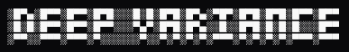

<p align="center">
  
</p>

<p align="center">
  <strong>Optimized Inference API for Coding</strong> &nbsp;·&nbsp; VS Code integration
</p>

<p align="center">
  <a href="https://github.com/deepvariance/vscode-extension/actions/workflows/ci.yml"></a>
  <a href="https://www.npmjs.com/package/@deepvariance/vscode"></a>
  
  
</p>

## Quickstart

```bash
npx @deepvariance/vscode
```

Enter your email — no API key to copy, no config files to edit. Then, in VS Code, open the Command
Palette and run **Developer: Reload Window**. Open Chat and pick the model from the list.

## Models

| Model | Context |
|---|---|
| **Qwen3.5 27B** | 131k tokens |

## Capabilities

- **Reasoning** — the model shows its thinking before it answers
- **Tool use** — works in Chat's agent mode, so it can read and edit your code
- **Vision** — attach a screenshot, a diagram, or an error dialog (up to 4 images)

## Requirements

- VS Code 1.104 or newer — or a fork (Cursor, Windsurf, VSCodium, Insiders)
- Node.js 18 or newer, with npm (for `npx`)

## Options

Most people never need these.

```bash
npx @deepvariance/vscode --health   # is the server up?
```

| | |
|---|---|
| `--email <email>` | Skip the email prompt |
| `--gateway <url>` | Use a different server |
| `--invite <token>` | Use a different invite |
| `--yes` | Don't ask anything |
| `--health` | Check the server and exit |

## Building on this?

**[SPEC.md](./SPEC.md)** is the single source of truth: the gateway contract, the VS Code constraints
that rule out the obvious designs, a change recipe per kind of edit, and a bug ledger. Contribution
workflow is in **[CLAUDE.md](./CLAUDE.md)** — every change goes on a branch and lands via reviewed PR.

---

> **Beta.** Deep Variance's inference API is in active development. Availability, models, and behavior
> may change without notice, and the service may be unavailable at times. Not for production use.
